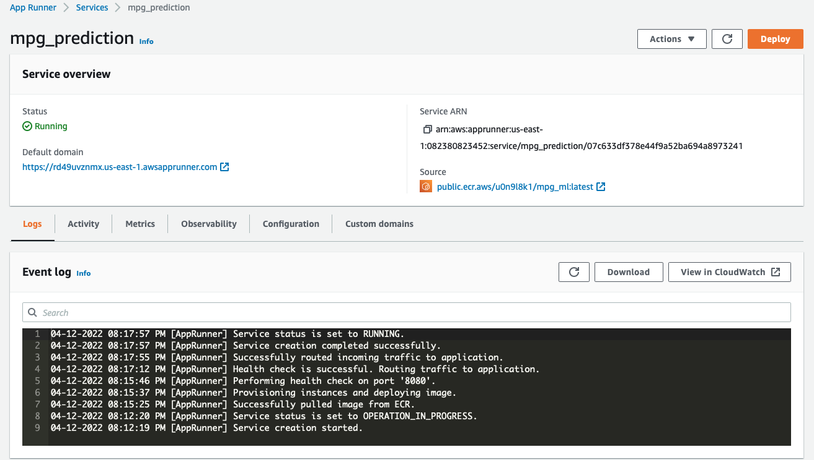

# Car Miles Per Gallon (MPG) prediction

This application uses some car information such as'cylinders','displacement','horsepower','weight','acceleration' and 'year' to predict MPG. I have used AWS ECR to build and push the Docker image to create a container for continuous deployment. This app was later deployed using AWS Application Runner.

## Dataset

[Car dataset from Kaggle](https://www.kaggle.com/datasets/uciml/autompg-dataset)

## AWS Cloud9 instructions before running:

1. Create virtual environment: python3 -m venv ~/.app
2. Source it: source ~/.app/bin/activate
3. Make all

## ECR screenshot

## Demo

https://user-images.githubusercontent.com/53462948/163076891-f81019e5-08a7-4e97-a56b-233147e9a9b9.mov

